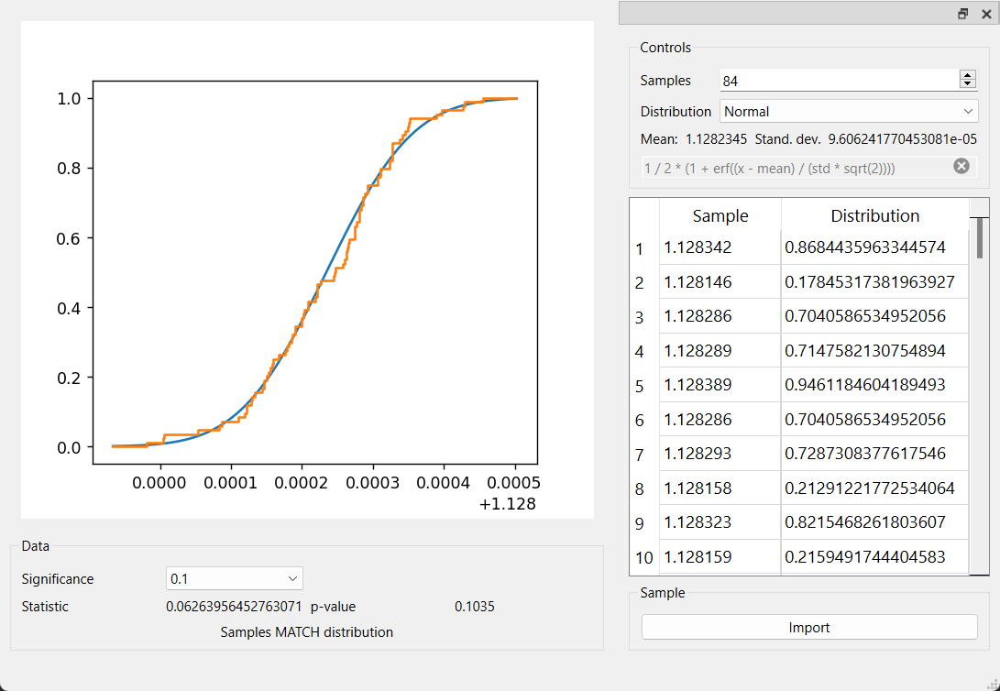

## Приложение для обработки многократных измерений

Данное приложение позволяет в автоматическом режиме обрабатывать большие выборки
по критерию Крамера-Мизеса-Смирнова.

### Результат работы программы для предоставленной выборки

Для проверки гипотезы о соответствие выборки распределению используется критерий омега-квадрат (Мизеса-Смирнова).  
Требования для запуска приложения:
* Интерпретатор Python3.9;
* Библиотеки из requirements.txt (pip install -r requirements.txt);
* Запуск.

Когда приложение запущено необходимо добавить исследуемую выборку в буфер.  
Для этого:
* нажимаем кнопку "Import";
* выбираем текстовый файл с данными
(разделённые переносами строк вещественные числа, записанные с точками между целой и дробной частями);
* выбираем уровень значимости (выпадающий список "Significance");
* получаем результаты в нижней части экрана.

Программа сообщит о том, принадлежит ли выборка к распределению * 
сообщение "Samples MATCHES distribution" в примере.  
Приложение обрабатывает выборку по следующему алгоритму:
* находится общее количество элементов; 
* их среднее значение;
* вычисляется стандартное отклонение;
* вычисляются значения функции распределения в соответствующих точках;
* вычисляются значения эмпирической функции распределения;
* находится статистика w^2;
* статистика сравнивается с табличным значением и делается вывод.
